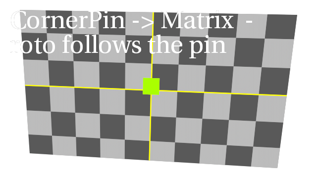
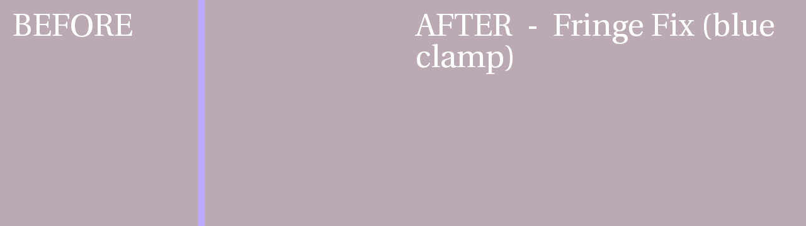
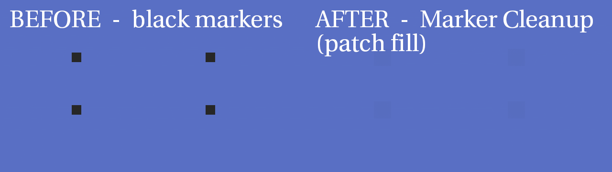
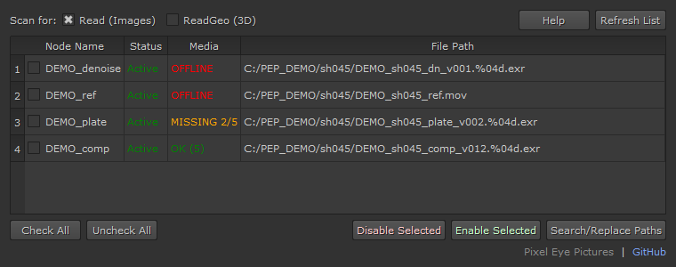
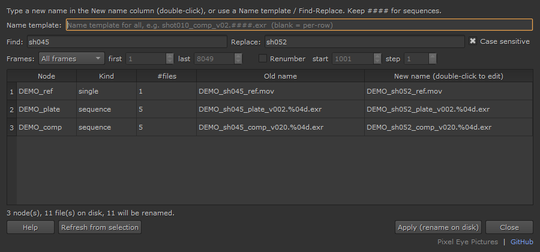
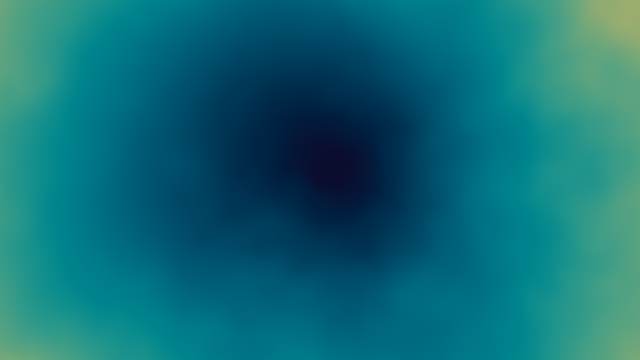

# PEP Nuke Tools

Nuke gizmos and tools from **Pixel Eye Pictures**. Free to use and modify
under the GPL-3.0 license (see `LICENSE`).

_These tools are made with keeping freelancers in mind._

📖 **Full per‑tool help:** [HELP.md](HELP.md) (also available in‑app — Help tab / Help button).

**Nuke 14+** — built and tested in Nuke 14 (Python 3; PySide2 with a PySide6
fallback for Nuke 15+).

---

## Preview

**CornerPin → Matrix** — drive a Roto/paint from a corner pin so it follows the plate:



**Fringe Fix** — clamp coloured edge fringing:



**Marker Cleanup** — remove tracking markers (patch-fill mode shown):



**Read Node Manager** — see/enable/disable and relink all Reads at once:



**Rename & Relink** — rename rendered files on disk (single / sequence / batch) and relink:



**Gradient** — multi-stop background with shapes, depth fog and noise break-up:



**Match Blacks** — clean a colour cast out of the shadows (before / after):


**Clipping Degrain** — denoise the lifted blacks without banding (before / after):


---

## Tools

| Tool | Type | What it does |
|------|------|--------------|
| **CornerPin to Matrix** | gizmo `PEP_CornerPinMatrix` | Convert a CornerPin's corners into a 4x4 matrix and paste it into a Roto / RotoPaint / CornerPin2D so the shape follows the pin. Static or baked over a range. |
| **CornerPin to Matrix v2** | gizmo `PEP_CornerPinMatrix_v2` | Same, plus a **transpose** toggle and a **live expression-link** (target updates as the corners move) for CornerPin2D targets. |
| **CornerPin to Matrix (panel)** | Python | Dialog version of the above (no gizmo node). |
| **Fringe Fix** | gizmo `PEP_FringeFix` | Kill coloured edge fringing (red/blue/magenta) by clamping the channel to the average of the other two, or realign chromatic aberration with a per-channel chroma shift. Mix control; mask externally if needed. |
| **Read Node Manager** | Python | List every Read / ReadGeo with status + path and a **Media** flag (OK / MISSING x/n frames / OFFLINE); batch **enable/disable**; and **relink paths** (find/replace or per-node edit) — e.g. repoint every pass from `sh045` to `sh052` in one go. |
| **Rename & Relink** | Python | Rename the actual **rendered files on disk** (single / sequence / batch) and relink the node — fix a typo, wrong version, or rename a shot without leaving Nuke or re-rendering. Type a **name template** (keep `####`), **Find/Replace**, choose **frames** (all / range / current), and optionally **renumber** (start/step). Rename-only, previews, never overwrites. |
| **Marker Cleanup** | Python | Tracking-marker removal. **Channel swap** for coloured markers (green/blue screen, orange/red/green/magenta), **Patch fill** for black/neutral markers, and **Smooth fill (Spot Remover)** — the exponential-blur fill driven by the marker matte. Builds the network for you. |
| **Spot Remover** | Python (builds a group) | Fast, smooth spot / marker fill. Feed a plate and a matte over the spot; it pulls the surrounding pixels in and fills the hole with an **exponential blur** — smoother and faster than an iterative patch. **Fill Blur / Edge Blur / Sample Size / Blur Angle** controls; reusable engine shared with Marker Cleanup. |
| **TrackPin** | Python (builds a group) | A tidy **stabilize / match-move** CornerPin rig. Fill the `to` corners with a 4-point track, pick a **reference frame**, choose **Match Move** (a held still rides the track) or **Stabilize** (lock the plate). Fill from a Tracker's exported CornerPin, keep edges, bake to keyframes, or **Send to Matrix** to bake onto a Roto/RotoPaint. |
| **Clipping Degrain** | Python (builds a group) | Denoise cleanly against crushed blacks / blown whites: lifts the signal off the clip point, denoises in the headroom, then reverses exactly. **No plugin lock-in** — swappable inner denoiser (Median / Nuke Denoise / **Neat Video** auto-detected) with an *Open denoiser controls* button. **Blacks / Whites / Both** mode; lossless when idle. |
| **Gradient** | Python (builds a group) | Multi-stop background / gradient generator. **Up to 4 colour stops**, shapes **Linear / Radial / Box / Diamond / Depth**, and **noise break-up** to kill banding. **Depth mode** remaps a depth pass through the stops for an instant depth fog. Smooth (blur) controls, lockable centre handle. |
| **Match Blacks** | Python (builds a group) | Match / neutralise / crush the **low range only** without touching mids or highlights. Remap a **Source** colour in the shadows to a **Target**. One-click **Neutralise** (kill a cast), **Zero blacks**, or **Match to reference** (sample a reference plate's blacks). **Softness** feathers into the mids. |

---

## Install

### Automatic (recommended)

Add the `gizmos/pep_tools` folder to your `NUKE_PATH`, or add this line to
your `~/.nuke/init.py`:

```python
import nuke
nuke.pluginAddPath('/path/to/pep_nuke_tools/gizmos/pep_tools')
```

Nuke auto-loads the gizmos (available under **Tab**) and adds a **PEP Tools**
menu. Restart Nuke after installing.

### Manual (studio setup)

Copy the `gizmos/pep_tools` folder into any location already on your
`NUKE_PATH`. See Foundry's guides on *Loading Gizmos, Plugins, Scripts* and
*Custom Menus and Toolbars*.

---

## Usage — CornerPin to Matrix

1. Get your corner-pin data (track it, or animate a `CornerPin2D`'s `to` corners).
2. **Tab → `PEP_CornerPinMatrix`** (or **PEP Tools → CornerPin to Matrix**).
3. Set / link the gizmo's `to` / `from` corners.
4. Draw your Roto / RotoPaint.
5. Select the **gizmo + your target**, then on the **Matrix** tab:
   - **Paste matrix into selected node** — bakes the matrix (tick *bake* +
     set *first/last* for animated pins).
   - **v2 → Live link** — expression-links the target to the gizmo so it
     updates as the corners change (CornerPin2D targets only).

The controller follows the pin. If it ever moves the wrong way, toggle
**invert** and re-apply.

> Note: live-link is not available for Roto/RotoPaint (their shape transform
> is curve-based and cannot be expression-linked) — use **Paste / bake** there.

Every gizmo also has a **Help** tab in its properties panel.

---

## Examples

### Stick a paint/roto to a tracked surface
1. Track 4 points on the surface → **Tracker → CornerPin** (creates a `CornerPin2D`).
2. Tab → **`PEP_CornerPinMatrix_v2`**. Link its `from`/`to` to the CornerPin (copy/paste the corner values, or expression-link).
3. Paint your fix on frame 1 with a **RotoPaint** drawn over the reference frame.
4. In the gizmo's **Matrix** tab: set **target node** = your RotoPaint (or *Set from selected*), tick **bake**, set **first/last** to the shot range, press **Paste matrix into target**.
5. Scrub — the paint now rides the corner pin. Wrong direction? toggle **invert**, paste again.

### Live-updating screen replacement
1. Tab → **`PEP_CornerPinMatrix_v2`**, set/link its corners.
2. Add a **CornerPin2D** for your insert, set **target node** to it, press **Live link into target**.
3. Now tweaking the gizmo's corners updates the insert live — no re-baking.

### Kill a blue/purple edge fringe
1. Tab → **`PEP_FringeFix`** after the offending node.
2. **method** = *Channel clamp*, **channel** = *blue* (or the fringing channel), **mix** = 1.
3. Still hot on hard edges? drop **mix**, or mask the node with a garbage matte so it only touches the fringe.

### Realign chromatic aberration
1. **`PEP_FringeFix`**, **method** = *Chroma shift*, pick the **channel** that's off, nudge **chroma scale** (e.g. `1.001` / `0.999`) until the channels register.

### Remove orange markers on green screen
1. Select the plate. **PEP Tools → Marker Cleanup** → **Channel swap** → preset *Green screen / warm markers*.
2. Refine the `MC_MarkerMask` roto around the markers and wipe the `MC_MatchScreen` grade to match the screen.

### Remove black/neutral markers
1. Select the plate. **Marker Cleanup** → **Patch fill**.
2. Tune the `MC_DarkKey` range to isolate the dark markers; raise **fill blur size** / **grow** until the holes fill with surrounding screen.

### Move a whole script to a new shot number
1. **PEP Tools → Read Node Manager** → **Check All**.
2. **Search/Replace Paths** → Find `sh045` → Replace `sh052` → **Apply** (repeat for the version, e.g. `_v003` → `_v001`).
3. Every Read (all passes) repoints at once — no re-importing. Match a distinctive token, not a bare number.

### Fix a typo in a rendered file (rename on disk)
1. Select the Read/Write node(s). **PEP Tools → Rename & Relink**.
2. Type the new name in the **New name** column (keep `####` for sequences), or use **Find/Replace** / a **Name template** for batches.
3. Optional: set **Frames** (all / range / current), or tick **Renumber** (start/step) to recount frames.
4. Check the **Old → New** preview and file counts → **Apply**. It renames on disk and relinks — no re-render.

### Stabilize a shot, paint, then re-apply the move (TrackPin)
1. Track 4 points → **Tracker → export → CornerPin2D**.
2. **PEP Tools → TrackPin**. Set **source node** to that CornerPin and press **Fill corners from node**.
3. Set the **reference frame**, choose **mode = Stabilize**, press **Apply** — the plate locks.
4. Paint your fix on the locked frame, then switch **mode = Match Move** and **Apply** to ride the motion back on.

### Denoise crushed blacks without banding (Clipping Degrain)
1. **PEP Tools → Clipping Degrain** after the plate. Turn on **Show clip**.
2. Raise **Remove clip (blacks)** until the white flags clear (you're lifting off the clip point).
3. Turn off **Show clip**, press **Open denoiser controls**, and set up your denoiser (or tick **Use Neat Video** if installed).

### Build a depth fog (Gradient)
1. **PEP Tools → Gradient**. Plug a **depth pass** into the input, set **shape = Depth**.
2. Set **depth near / far** to frame the range, and set **colour stops** (e.g. clear → haze colour).
3. Raise **noise amount** (and **noise blur / smooth**) for patchy, organic fog. Tick **lock centre** so you don't nudge the handle.

### Paint out a spot / marker (Spot Remover)
1. Feed the plate into input 1 and a matte over the spot into input 2 (a painted alpha or a white blob both work).
2. **PEP Tools → Spot Remover**. Raise **Fill Blur Size** until the hole fills from the surrounding pixels.
3. Tune **Sample Size** (how far outside to sample) and **Edge Blur**; add **Blur Angle** for a directional fill. Or use Marker Cleanup's **Smooth fill** mode to drive it from a keyed marker matte.

### Neutralise a colour cast in the blacks (Match Blacks)
1. **PEP Tools → Match Blacks**. Set **Pin Blacks** to the top of the range to affect.
2. Eyedrop the cast into **Source Color**, then press **Neutralise** (or **Match to reference** with a reference plate on input 2).
3. Add **Softness** so the correction feathers into the mids.

---

## License

GPL-3.0 (c) Pixel Eye Pictures. See `LICENSE`.
